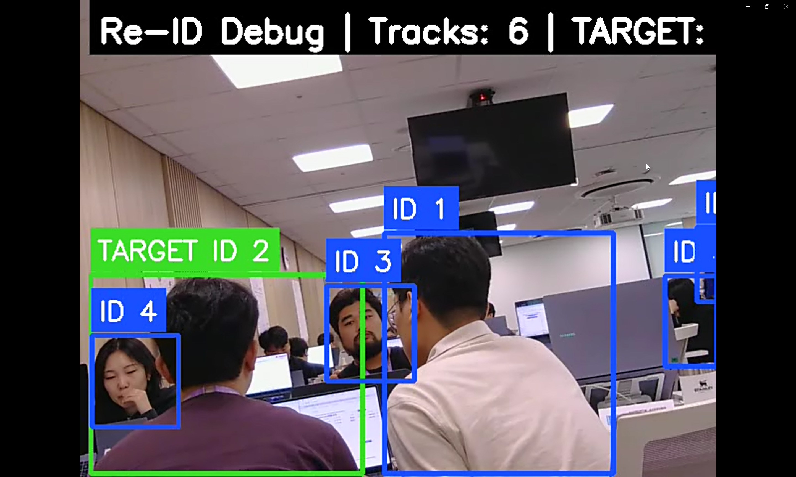
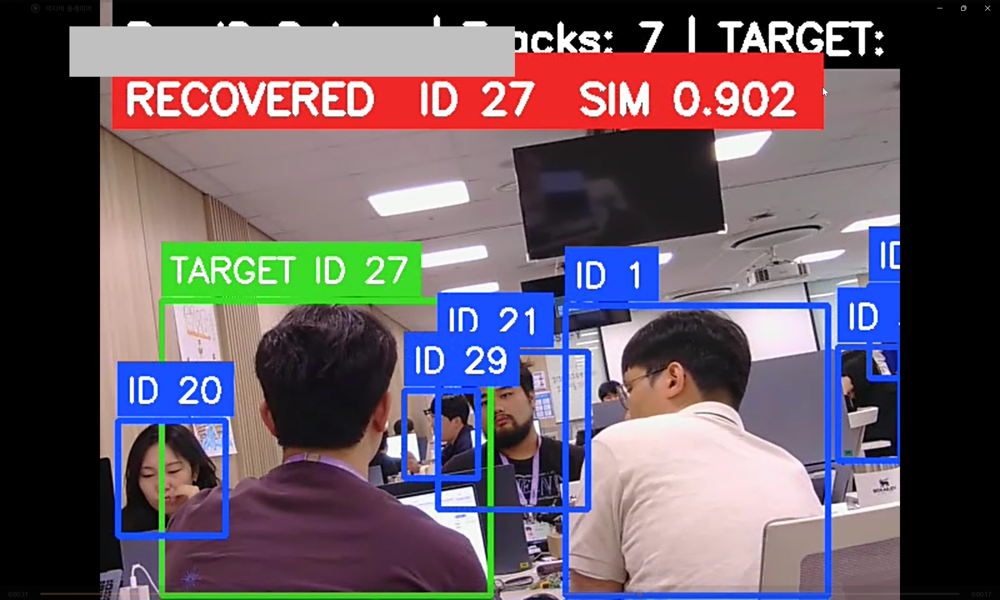

# 쫄래쫄래

## Overview
사서를 따라다니며 구역별 도서 정리를 돕는 자율주행 북카트

Face Recognition가 아닌 Person Re-Identification(Re-ID)로 동일 인물을 추적

ROS2 기반 **Jetson Orin Nano 8GB**에서 구동

  <tr>
    <td></td>
    <td></td>
  </tr>
</table>

## Key Features

- Person Detection (YOLOv10s TensorRT)
- Multi Object Tracking (ByteTrack)
- Person Re-Identification (OSNet)
- Online Memory Bank
- LiDAR-based Distance Control
- PID Motion Control
- ROS2 Integration

## Hardware

- Jetson Orin Nano 8GB
- RGB Camera
- 2D LiDAR
- Differential Drive Robot

## Repository Structure

    AIOT-LIBRARY-BOOK-CART/
    ├── ros2_ws/
    │   └── src/
    │       └── person_follow_robot/
    │           ├── launch/
    │           │   └── follow_robot_launch.py
    │           ├── person_follow_robot/
    │           │   ├── __init__.py
    │           │   ├── camera_node.py
    │           │   ├── debug_visualization_node.py
    │           │   ├── reid_node.py
    │           │   ├── control_node.py
    │           │   ├── detector_node.py
    │           │   ├── motor_node.py
    │           │   └── tracker_node.py
    │           ├── resource/
    │           │   └── person_follow_robot
    │           ├── package.xml
    │           ├── setup.cfg
    │           └── setup.py
    ├── models/
    ├── .gitignore
    ├── AI_SPECIFICATIONS.md
    ├── DEVELOPMENT_GUIDE.md
    ├── install_ros2_humble.sh
    ├── PROJECT_CHARTER.md
    ├── README.md
    ├── JETSON_TO_STM.md
    └── SYSTEM_ARCHITECTURE.md
    

## Documentation

| Document | Description |
|----------|-------------|
| PROJECT_CHARTER.md | 프로젝트 목표, 제약 |
| SYSTEM_ARCHITECTURE.md | 시스템 구조 + ROS2 구조 + 데이터 흐름 |
| AI_SPECIFICATIONS.md | AI 명세 + 기술 선택 이유 |
| DEVELOPMENT_GUIDE.md | 개발 환경 설정, Coding Rules, 아키텍처 원칙 및 TODO |
| JETSON_TO_STM.md | STM 통신 관련 |

## Current Progress

Step 1
- [ ] YOLOv10 TensorRT
- [ ] ByteTrack

Step 2
- [ ] OSNet
- [ ] Memory Bank

Step 3
- [ ] LiDAR
- [ ] PID
- [ ] Optimization