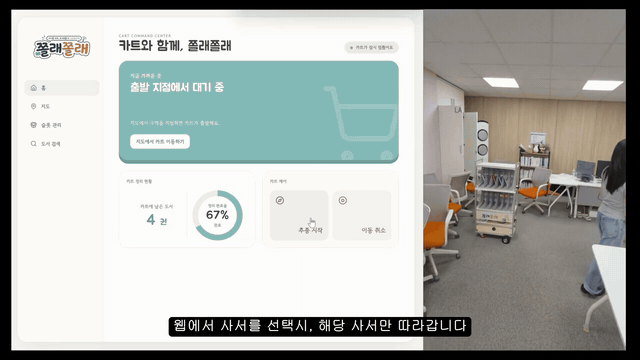
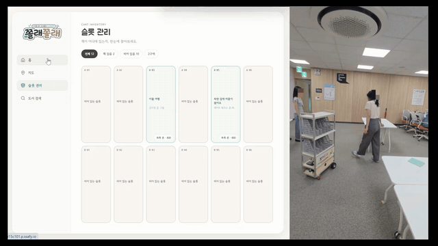
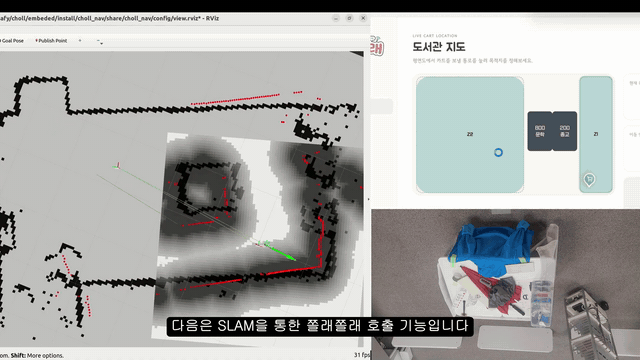

# 쫄래쫄래 (Choll)

> **사서를 따라다니며 구역별 도서 정리를 돕는 자율주행 북카트**
> SSAFY 15기 공통 프로젝트 · 5인 팀 · 2026.07.16 ~ 2026.08.11 (발표) · 이후 자율주행 스택 완성

사서가 북카트에 책을 실으면 카트가 **RFID로 어떤 책인지 인식**하고, 얼굴 인식이 아닌
**Person Re-Identification(Re-ID)** 으로 사서를 졸졸 따라다니며, 웹 화면에서
**정리 진행률과 카트 위치를 실시간으로** 보여줍니다.



---

## 목차

1. [주요 기능](#주요-기능)
2. [검증 범위](#검증-범위)
3. [시스템 아키텍처](#시스템-아키텍처)
4. [AI 파이프라인](#ai-파이프라인)
5. [기술 스택](#기술-스택)
6. [저장소 구조](#저장소-구조)
7. [실행 방법](#실행-방법)
8. [문서](#문서)
9. [팀](#팀)

---

## 주요 기능

### 🚶 사람 추종 (AI)

- **타겟 등록**: 카트에 가장 가까운 사람(최대 bbox)을 자동 선택해 2초간 등록 — 또는 웹 화면의 카메라 영상에서 사서를 직접 클릭해 선택
- **동일 인물 추적**: YOLOv10s(TensorRT) 탐지 → ByteTrack 추적 → OSNet Re-ID 특징(512-D)을 Memory Bank에 저장
- **가림 복구**: 장애물·사람에 가려 사서가 시야에서 사라지면 일단 정지하고, 다시 나타나면 Re-ID 매칭으로 같은 사서를 재식별해 추종 재개
- Jetson Orin Nano 8GB에서 **실시간(10 FPS+) 구동**



### 📚 도서 인식·정리 작업 (EM + BE)

- 슬롯에 책을 올리면 **RFID 태깅**으로 어떤 책인지 자동 인식
- 카트가 서가 구역에 진입하면 **그 구역에 꽂을 책이 있는 슬롯의 LED 점등**
- 도서 인식 시 정리 작업 자동 생성, 책 제거 시 완료 처리 → 진행률 계산

### 🗺️ 실시간 모니터링·제어 (FE + BE)

- **슬롯 상태 보드**: 슬롯별 비어 있음/책 있음/인식 실패, 책 정보(제목·구역), 만적 알림
- **지도**: 평면도 위 카트 실시간 위치·방향(yaw)·구역 진입 팝업
- **카트 제어**: 추종 시작/일시정지/종료, 카트 연결 상태(하트비트) 표시
- **실시간 영상**: 카트 카메라 영상 스트리밍(WebSocket 바이너리 JPEG) + AI 탐지 박스 오버레이

### 🤖 자율주행 (EM)

- SLAM 매핑(slam_toolbox)·지도 정합·localization, Nav2 P2P 주행, MQTT↔ROS2 브릿지
- **쫄래쫄래 호출**: 웹 지도에서 위치를 찍으면 카트가 해당 지점까지 자율주행
- 발표일(2026-08-11)까지는 미완이라 시연에서 제외됐으나 **발표 이후 완성** — 아래 참조



## 검증 범위

공식 발표 시연(2026-08-11)은 **계획했던 Nav2 자율주행이 아니라, 사전에 설계해 둔 폴백 구성**
(AI PID 단순 추종 + 카트 위치 수동 발행)으로 진행됐습니다. 발표 시점에 무엇이 증명됐고
무엇이 안 됐는지, 왜 그랬는지는 **[docs/RETROSPECTIVE.md](docs/RETROSPECTIVE.md)** 에
커밋·테스트 로그 근거와 함께 정직하게 기록했습니다.

**발표 이후 남은 이슈를 해결해 계획했던 아키텍처대로 프로젝트를 완성했으며**,
이 README의 데모 GIF들은 완성본 시연 영상에서 잘라낸 것입니다.

| 영역 | 발표 시연 (2026-08-11) | 최종 (발표 이후) |
|---|---|---|
| Re-ID 사람 추종 (가림 복구 포함) | ✅ 실기 시연 (PID 폴백 경로) | ✅ |
| RFID 인식 → 웹 실시간 반영 → 구역 LED 안내 → 진행률 | ✅ 실기 시연 | ✅ |
| SLAM 매핑·지도 정합 (벽거리 median 0.031 m) | ✅ 실측 검증 | ✅ |
| Nav2 P2P 목적지 도달 | ✅ 실측 (오차 0.184 m) — 시연 미포함 | ✅ 완성 |
| 지도 클릭(호출) 이동 · SLAM localization 상시 운용 | ❌ 미완 | ✅ 완성 |

## 시스템 아키텍처

```
[사서용 웹 (FE)] ←─ REST / WebSocket ─→ [허브 서버 (BE)] ←─ MQTT ─→ [북카트]
                                             │                        ├── AI (Jetson): 사람 인식·추종
                                          MySQL                       └── EM (STM32·RPi): SLAM·모터 구동·RFID·LED
```

- **FE ↔ BE**: REST(`/api/carts/{cartId}/...`) + WebSocket 이벤트(`/ws/carts/{cartId}`) + 영상(`/ws/carts/{cartId}/video`)
- **BE ↔ 카트**: MQTT — 상행 `status/*`(위치·슬롯·하트비트·추적 후보·내비 결과), 하행 `cmd/*`(이동·추종·LED)
- **카트 내부**: Jetson(AI·SLAM, ROS2) ↔ USB Serial ↔ STM32(모터), Raspberry Pi(RFID·LED)

상세: [docs/SYSTEM_ARCHITECTURE.md](docs/SYSTEM_ARCHITECTURE.md) · 전체 인터페이스 계약: [docs/specs/API_SPEC.md](docs/specs/API_SPEC.md)

## AI 파이프라인

```
RGB Camera → YOLOv10s(TensorRT) → ByteTrack → [최근접 자동 선택 → 2초 등록 | FE 클릭 선택] → OSNet Re-ID
    → Memory Bank → (추적 성공 | 추적 실패 → Re-ID 재탐색) → Target Track ID
    → (최종) 방위각+거리+카트 포즈 융합 → /target_position → EM Nav2 경로계획·주행
    → (발표 시연 폴백) 화면 중심 오차 + LiDAR 거리 → PID → /cmd_vel → STM32
```

- **스택 고정**: YOLOv10s TensorRT · ByteTrack · OSNet · Online Memory Bank — Fine-tuning 없이, 추가 데이터셋 수집 없이, TensorRT 추론만으로 동작
- **성능 예산**: 10 FPS+ (LiDAR ~10 Hz 기준), 지연 < 100 ms, GPU 메모리 < 6 GB
- 모델 선택 이유와 파라미터: [docs/AI_SPECIFICATIONS.md](docs/AI_SPECIFICATIONS.md) · 벤치마크: [docs/specs/TECH_STACK.md](docs/specs/TECH_STACK.md)

## 기술 스택

| 파트 | 디렉토리 | 스택 | 시작 문서 |
|------|----------|------|-----------|
| AI (추종·인식) | [ai/](ai/) | ROS2 Humble · Python 3.10 · YOLOv10s TensorRT · ByteTrack · OSNet | [ai/README.md](ai/README.md) |
| BE (허브 서버) | [backend/](backend/) | Java 21 · Spring Boot 4.1.0 · Spring Data JPA · MySQL 8.4 · MQTT(Mosquitto) · Swagger | [backend/CLAUDE.md](backend/CLAUDE.md) |
| FE (사서용 웹) | [frontend/](frontend/) | React 18 · TypeScript · Vite · TanStack Query · Zustand · Ant Design · MSW/orval · Playwright | [frontend/CLAUDE.md](frontend/CLAUDE.md) |
| EM (SLAM·자율주행) | [embedded/Lidar/](embedded/Lidar/) | slam_toolbox · AMCL · Nav2 · EKF · YDLIDAR X4Pro | [embedded/Lidar/CLAUDE.md](embedded/Lidar/CLAUDE.md) |
| EM (모터·RFID·LED) | [embedded/](embedded/), [ros2_ws/](ros2_ws/) | STM32 NUCLEO-F446RE(C·HAL) · Raspberry Pi(Python) · USB Serial 브릿지 | [embedded/CLAUDE.md](embedded/CLAUDE.md) |
| Infra (배포) | [infra/](infra/) | AWS EC2 · Docker · nginx · Jenkins (main 브랜치 웹훅 자동 배포) | [Jenkinsfile](Jenkinsfile) |

## 저장소 구조

    Choll/
    ├── README.md            # (이 문서) 프로젝트 전체 소개
    ├── CLAUDE.md            # AI 에이전트/기여자 진입점 — 저장소 지도, 규칙
    ├── ai/                  # AI 파트 (ROS2 워크스페이스 + 단위 테스트)
    ├── backend/             # BE 파트 (Spring Boot)
    ├── frontend/            # FE 파트 (React)
    ├── embedded/            # EM 파트 (STM32·RPi·SLAM/Nav2 워크스페이스)
    ├── ros2_ws/             # EM 파트 (모터 구동 ROS2 워크스페이스)
    ├── infra/               # 배포 compose
    ├── docs/                # 프로젝트 공통 문서 (단일 진실 공급원)
    ├── tests/               # 파트 공통 테스트 규칙·공용 테스트 로그
    └── scripts/             # 유지보수·시연 보조 스크립트

## 실행 방법

전체 빌드·배포·실행 절차의 정본은 **[docs/SETUP.md](docs/SETUP.md)** 입니다. 요약:

```bash
# Frontend (frontend/)
pnpm install && pnpm dev        # BE 없이 화면만: .env.development.local에 VITE_ENABLE_MSW=true

# Backend (backend/) — MySQL 8.4 + Mosquitto 필요
./gradlew bootRun

# AI (Jetson, 저장소 루트에서 — 모델을 models/*.engine 상대경로로 찾음)
cd ai && colcon build --symlink-install && source install/setup.bash && cd ..
ros2 launch person_follow_robot follow_robot_launch.py

# 하드웨어 없이 E2E 재현 (가짜 카트)
python scripts/fake_jetson.py --broker localhost
```

## 문서

| 문서 | 내용 |
|------|------|
| [docs/PROJECT_CHARTER.md](docs/PROJECT_CHARTER.md) | 목표, 범위, 제약, 성공 기준 최종 판정 |
| [docs/RETROSPECTIVE.md](docs/RETROSPECTIVE.md) | **회고 — 발표 시연 시점의 계획 vs 실제, 원인 분석** (발표 이후 완성 전 기록) |
| [docs/SYSTEM_ARCHITECTURE.md](docs/SYSTEM_ARCHITECTURE.md) | 전체 시스템 · 파이프라인 · ROS2 토픽 |
| [docs/SETUP.md](docs/SETUP.md) | 빌드 · 배포 · 실행 · 로컬 E2E 재현 |
| [docs/specs/](docs/specs/) | 기능·API·ERD·기술스택·시나리오 명세 |
| [docs/AI_SPECIFICATIONS.md](docs/AI_SPECIFICATIONS.md) | AI 모델 명세와 선택 이유 |
| [docs/JETSON_TO_STM.md](docs/JETSON_TO_STM.md) | Jetson ↔ STM32 인터페이스 계약 |
| [docs/DEMO_RUNBOOK.md](docs/DEMO_RUNBOOK.md) | 시연 당일 절차 (시나리오 A/B/C 분기) |
| [docs/GIT_CONVENTION.md](docs/GIT_CONVENTION.md) | 브랜치 전략 · 커밋 메시지 · MR 템플릿 |
| [tests/TEST_LOG.md](tests/TEST_LOG.md) | 파트 공통 검증 기록 (원본 출력 보존) |

## 팀

SSAFY 15기 5인 팀. 공개 저장소에서는 역할로만 표기합니다.

| 역할 | 담당 |
|------|------|
| AI (추종·인식) · BE · 인프라 | 팀원 A ([@SeonYoo-Kim](https://github.com/SeonYoo-Kim)) |
| FE · 디자인 | 팀원 B ([@ghk2612](https://github.com/ghk2612)) |
| SLAM · 자율주행 | 팀원 C ([@BaekJae19](https://github.com/BaekJae19)) |
| 모터 제어 (STM32) | 팀원 D ([@relu00123](https://github.com/relu00123)) |
| LED · RFID (RPi) | 팀원 E |

개발은 AI 에이전트(Claude Code)와의 협업으로 진행됐으며, 검증 기록은
[tests/TEST_LOG.md](tests/TEST_LOG.md)와 [ai/test/TEST_LOG.md](ai/test/TEST_LOG.md)에
원본 출력으로 남아 있습니다.
