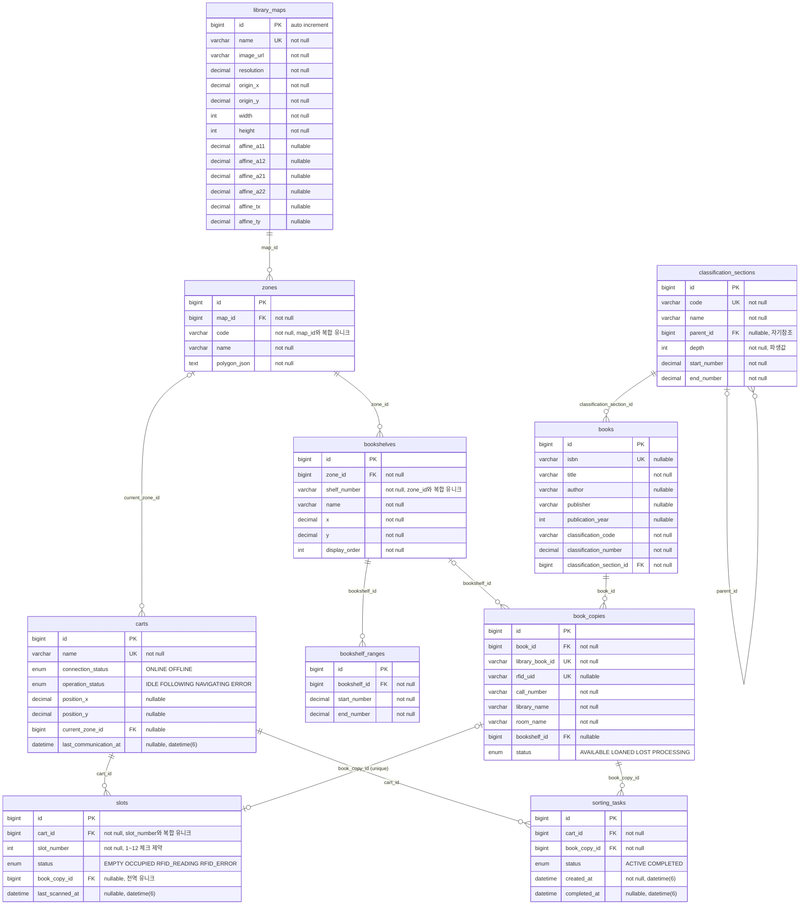

# ERD

> 실제 MySQL 스키마를 리버스 엔지니어링한 Workbench 모델([backend/erd.mwb](../../backend/erd.mwb))과
> JPA 엔티티 코드(`backend/src/main/java/**/domain/*.java`)를 교차 검증해 작성 (2026-08-11).
> 테이블 10개·FK 관계는 양쪽이 완전히 일치. 컬럼 타입(enum, datetime(6))은 DB 실측 기준.
> 아핀 6계수 컬럼은 mwb 스냅숏(08-06) 이후인 08-07에 추가돼 mwb에는 없지만 실 DB·코드·시드 SQL에 존재한다.

## 엔티티 설명

| 테이블 | 역할 |
|---|---|
| `library_maps` | SLAM 지도 = 좌표계 정의. `resolution`/`origin_x,y` 기본 변환에 더해, 평면도가 회전·반전 파생본일 때 쓰는 **아핀 6계수**(2026-08-07 추가)를 보유 — 6개가 모두 채워졌을 때만 아핀 변환 사용, 아니면 기본식 폴백 |
| `zones` | 지도 위 책장 구역. 시연 시드는 Z1(우측)·Z2(중앙)·Z3(좌측) 3개. `polygon_json`은 카트 현재 구역 판정(LED·정리 대상)에 사용 — 구역끼리 겹치면 안 됨 |
| `bookshelves` | 구역에 속한 책장 1면. 시드는 000 총류→Z1, 100·200→Z2, 800 문학→Z3 총 4면 |
| `bookshelf_ranges` | 책장이 담당하는 KDC 청구번호 구간 (예: 800~899.99999) |
| `classification_sections` | KDC 분류 트리 (자기참조, `depth`는 부모+1 파생값) |
| `books` | 서지(작품) 단위. ISBN 유니크(nullable — MySQL은 NULL 다중 허용) |
| `book_copies` | 실물 소장본. `rfid_uid`로 RFID 태그와 연결, 청구번호로 담당 책장 매칭 (담당 책장 없는 분류는 NULL) |
| `carts` | 정리 카트. 시연 구성은 1대 (`쫄래쫄래 카트`) |
| `slots` | 카트당 슬롯 12개 (1~12 체크 제약). 실물 RFID 리더는 5개만 설치 — FE `PHYSICAL_SLOT_COUNT=5` 참조. 한 소장본은 한 슬롯에만 존재 (전역 유니크) |
| `sorting_tasks` | 도서 정리 작업. RFID DETECTED로 생성(ACTIVE) → 서가 배치(REMOVED)로 COMPLETED |

## 설계 특이사항

- **모든 관계는 자식→부모 단방향 `@ManyToOne`** — `@OneToMany` 양방향 매핑 없음. 유일한 `@OneToOne`은 `Slot→BookCopy`(단방향, FK는 slots 쪽 + 유니크).
- **설정으로 하드 참조하는 행**: `mqtt.cart-id=1`, `mqtt.map-id=2` (application.properties) — DB 제약으로 보호되지 않는 코드 밖 계약.
- **FE↔BE 구역 조인은 id가 아니라 `zones.code`(Z1/Z2/Z3)** — FE는 번들 평면도의 `zones.ts` 코드로 그리고, 서버는 code로 매칭한 id를 내려준다.
